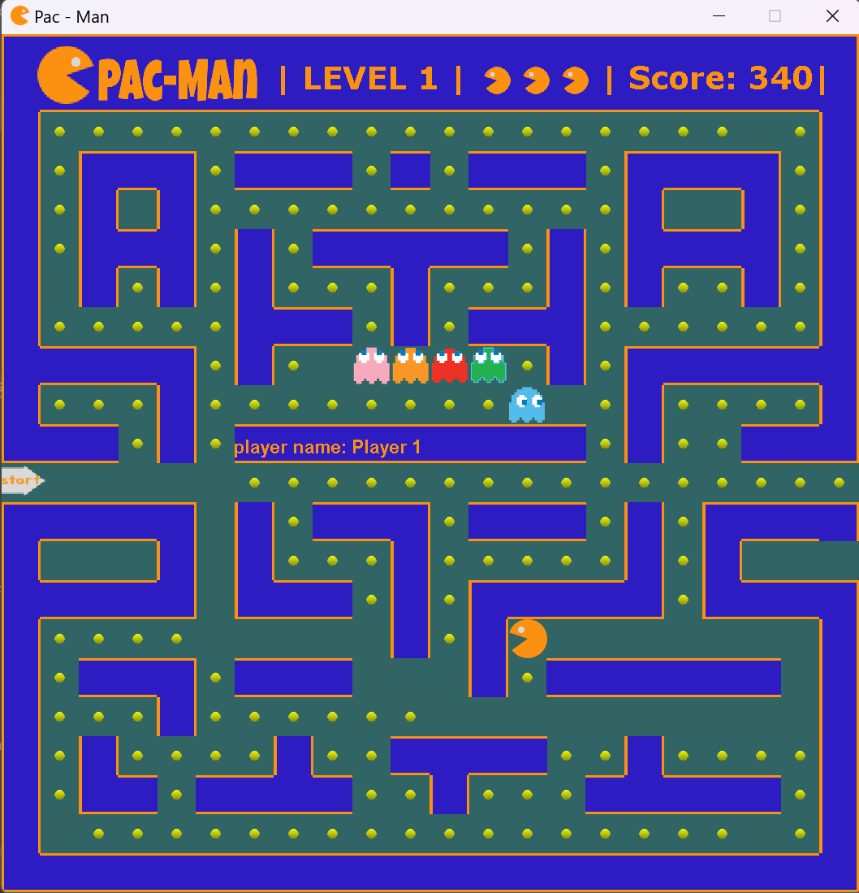

# Pac-Man Game

An exciting 2D Pac-Man game built in Java!

---

## About the Game

This Pac-Man game allows players to control the character and navigate through a maze while avoiding walls and obstacles. The game uses a grid-based layout and features collision detection for smooth gameplay.

---

## Features

- **Keyboard controls** for smooth movement.
- **Collision detection** to avoid walls.
- **Resizable Pac-Man character** without affecting grid size.
- **Optimized direction switching** for responsive gameplay.

---

## Installation

To install and run the game, follow these steps:

1. Clone the repository:
    ```bash
    git clone https://github.com/IsraelBenZeev/pacman-game.git
    ```
2. Navigate to the project directory:
    ```bash
    cd pacman-game
    ```
3. Run the game:
    ```bash
    java Main
    ```

---

## Screenshots

Here’s what the game looks like:



*Image has a bright yellow Pac-Man character in a dark maze with grid-based tiles.*

---

## Contributing

Want to improve the game? Feel free to fork the repository and submit a pull request. Bug reports are always welcome!

---

## License

This project is licensed under the **MIT License**.

---

<style>
body {
    font-family: Arial, sans-serif;
    background-color: #1d1d1d;
    color: #f5f5f5;
    margin: 0;
    padding: 0;
}

header {
    background-color: #ffcc00;
    color: #000;
    padding: 20px;
    text-align: center;
}

header h1 {
    margin: 0;
}

main {
    padding: 20px;
    max-width: 800px;
    margin: 0 auto;
}

section {
    margin-bottom: 20px;
}

h2 {
    color: #ffcc00;
    border-bottom: 2px solid #333;
    padding-bottom: 5px;
}

pre {
    background: #333;
    color: #f5f5f5;
    padding: 10px;
    border-radius: 5px;
    overflow-x: auto;
}

img {
    display: block;
    margin: 10px auto;
    border: 2px solid #ffcc00;
    border-radius: 5px;
}

footer {
    text-align: center;
    background-color: #ffcc00;
    color: #000;
    padding: 10px;
    position: relative;
    bottom: 0;
    width: 100%;
}
</style>

&copy; 2024 Pac-Man Game Project

